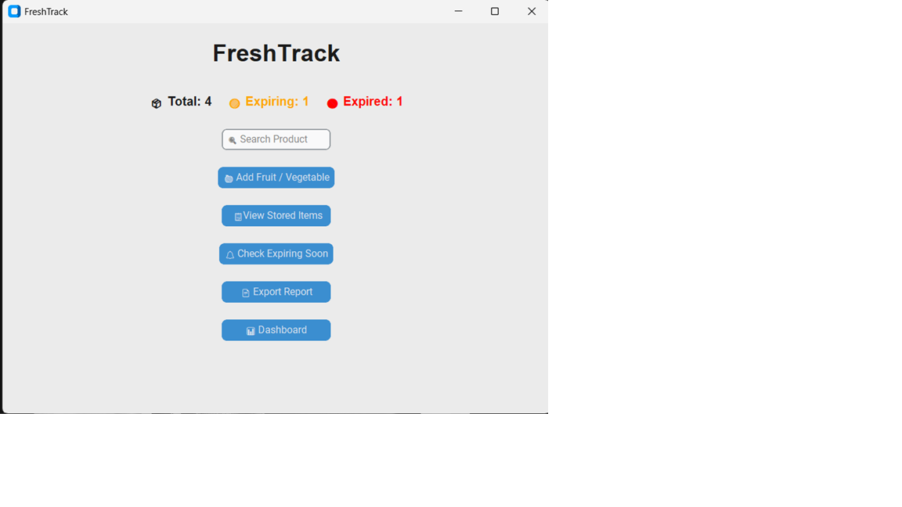
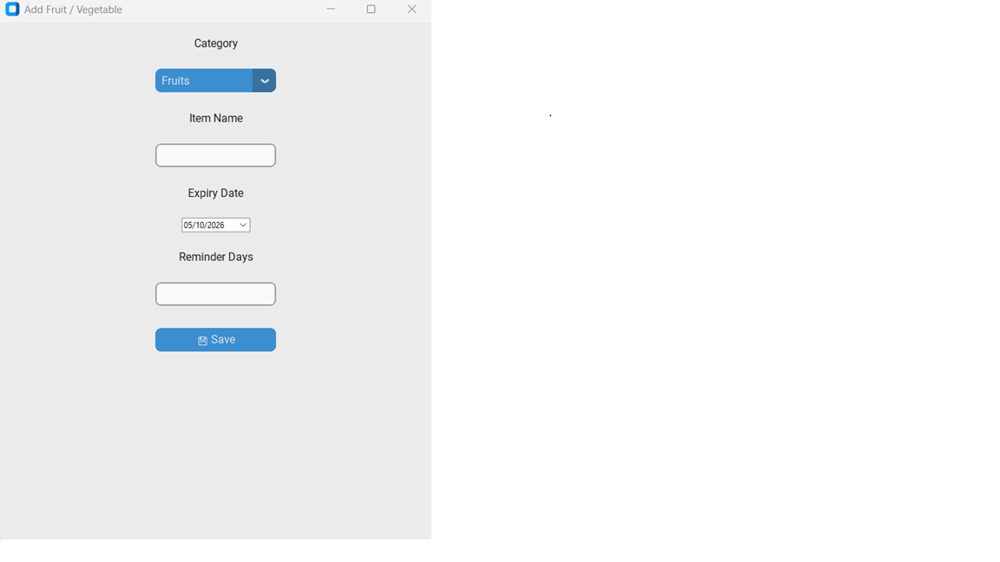
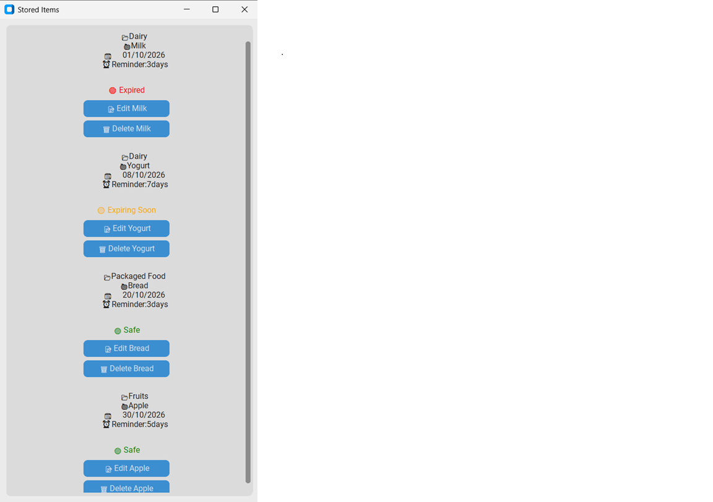
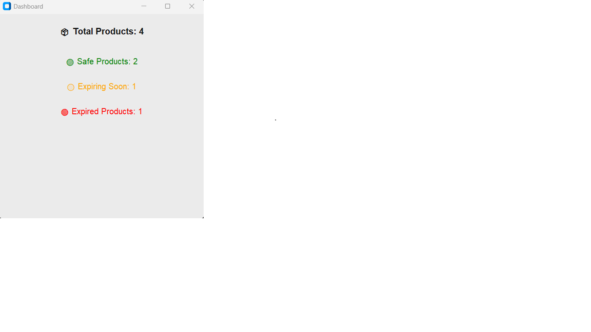

# 🥦 Expiry Tracker

A simple Python desktop application to track food expiry dates and get timely reminders. ⏰

## ✨ Features
- 📅 Add fruits, vegetables, dairy and more with expiry dates
- 🔔 Alerts for items expiring soon
- 🚦 Safe, Expiring Soon & Expired status
- 🔍 Search your stored items
- 📊 Dashboard with totals
- 📄 Export a CSV report

## 🛠️ Built With
🐍 Python · 🎨 CustomTkinter · 📅 tkcalendar · 🗄️ SQLite

## 🚀 Installation
```
git clone https://github.com/meghana-s-2007/Expiry-Tracker.git
cd Expiry-Tracker
pip install -r requirements.txt
python main.py
```

## 🎯 Goal
Reduce food waste by helping users keep track of expiry dates. 🌱

## 📸 Screenshots





